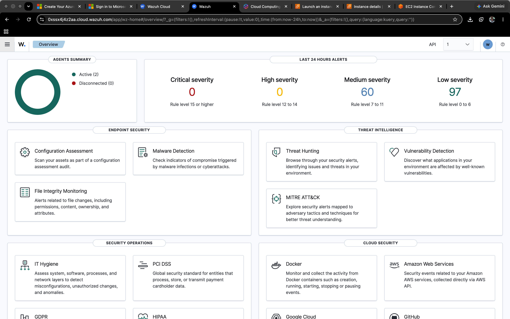
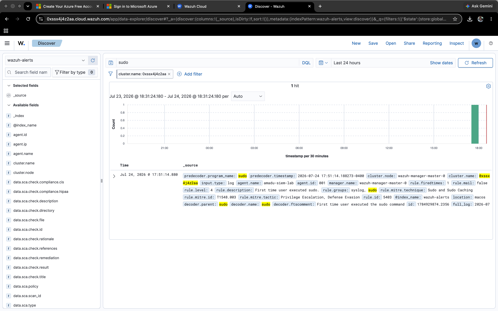
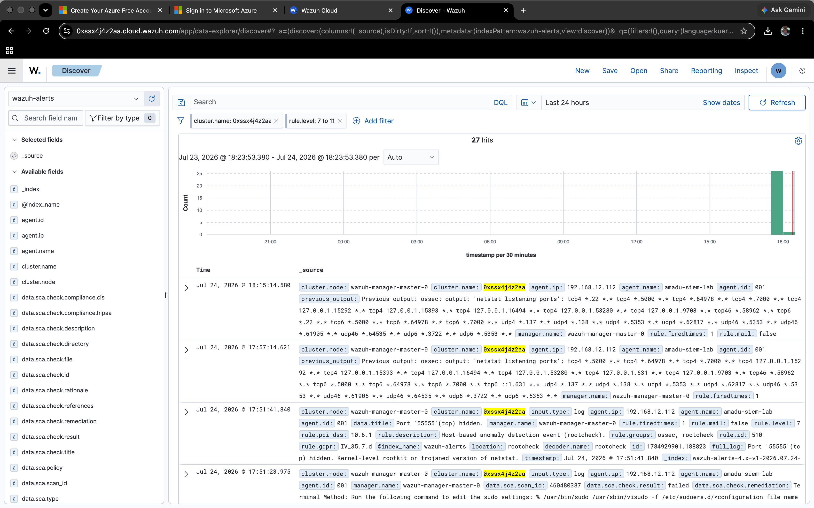
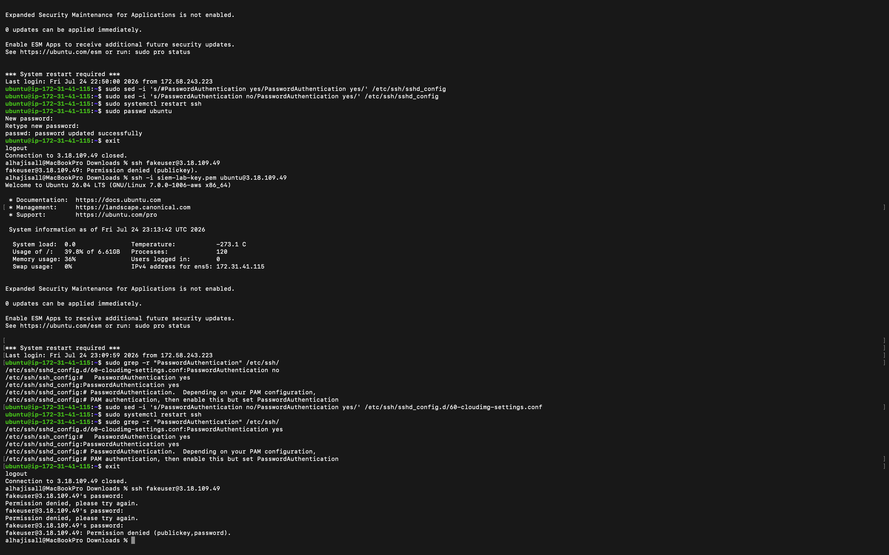
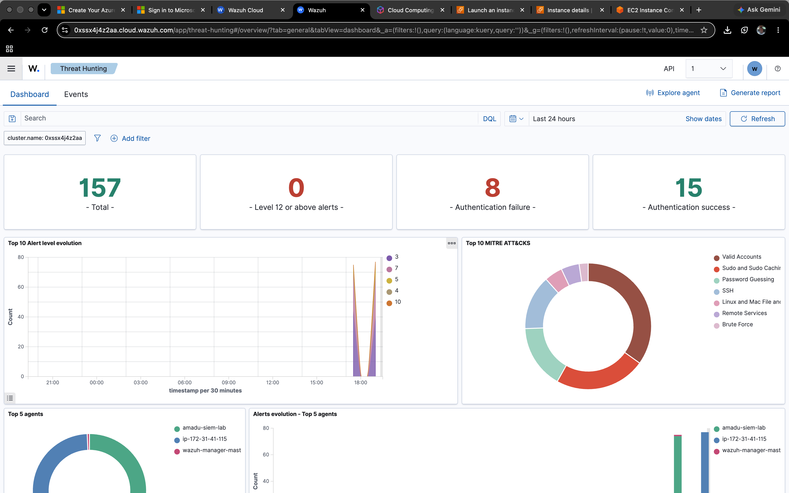

SIEM Detection Lab — Wazuh Cloud

Objective

Deploy a cloud-based SIEM (Wazuh) and validate its ability to detect and classify security-relevant activity on a monitored endpoint, using Wazuh's built-in detection modules (log analysis, rootcheck/anomaly detection, and Security Configuration Assessment).

Architecture

SIEM Manager: Wazuh Cloud (14-day trial, Small profile, US East region)
Endpoint 1: macOS agent (Apple Silicon) — personal MacBook Pro (amadu-siem-lab)
Endpoint 2: Ubuntu 24.04 LTS agent — AWS EC2 t3.micro instance, internet-facing (ip-172-31-41-115)

Methodology

Four categories of activity were generated across two monitored endpoints to validate detection coverage across different Wazuh modules and log sources:

1. Privilege Escalation Detection (Sudo Execution)

Executed privileged commands on the endpoint:

sudo touch /etc/testfile123
sudo rm /etc/testfile123
sudo whoami

Result: Wazuh detected the sudo execution and generated an alert automatically mapped to the MITRE ATT&CK framework.

| Field | Value |
|---|---|
| Rule ID | 5403 |
| Rule Description | First time user executed sudo |
| Rule Level | 4 |
| MITRE ATT&CK Tactic | Privilege Escalation, Defense Evasion |
| MITRE ATT&CK Technique | T1548.003 (Sudo and Sudo Caching) |

2. Host-Based Anomaly Detection (Rootcheck)

Wazuh's rootcheck module, running independently as part of its default scan schedule, flagged a potential anomaly:

| Field | Value |
|---|---|
| Rule ID | 510 |
| Rule Description | Host-based anomaly detection event (rootcheck) |
| Rule Level | 7 |
| Finding | Port 55555 (tcp) hidden — potential kernel-level rootkit or trojaned netstat |

Investigation: Verified the finding using lsof:

lsof -i :55555
sudo lsof -i :55555

Both commands returned no active process bound to the port, indicating the anomaly was caused by a transient process rather than a persistent rootkit or backdoor.

Conclusion: Assessed as a false positive. No further remediation required. This demonstrates a full alert-triage workflow — detect, investigate, verify, conclude — rather than passively accepting an alert at face value.

3. Security Configuration Assessment (SCA)

Wazuh's SCA module flagged a failed compliance check related to sudoers file configuration, mapped to PCI DSS and GDPR control references.

4. SSH Brute-Force Detection (Flagship Finding)

To properly validate authentication-failure detection, a second agent was deployed on a dedicated Ubuntu EC2 instance, since macOS's non-standard auth logging had prevented this on the first endpoint. From a separate machine, repeated failed SSH login attempts were made against the Ubuntu instance's public IP using an invalid username and password.

Troubleshooting required: the EC2 instance initially rejected all SSH attempts outright (Permission denied (publickey)) because password authentication is disabled by default on AWS Ubuntu images. Resolving this required locating and correcting an override in /etc/ssh/sshd_config.d/60-cloudimg-settings.conf (a cloud-init-managed file that takes precedence over the main sshd_config), then setting a test password for the login attempts to fail against.

Result: Wazuh correlated the repeated failures into a single high-severity brute-force alert.

| Field | Value |
|---|---|
| Rule Description | syslog: User missed the password more than one time |
| Rule Level | 10 |
| MITRE ATT&CK Technique | T1110 (Brute Force) |
| Compliance Mappings | HIPAA, PCI DSS, NIST 800-53, GDPR |

Individual failed-attempt events (rule level 5, "Attempt to login using a non-existent user") were also logged and fed into the higher-level brute-force correlation.

Findings Summary

| Test | Module | Outcome |
|---|---|---|
| Sudo execution (macOS) | Log analysis / MITRE mapping | Detected and classified correctly |
| Rootcheck anomaly (macOS) | Host-based anomaly detection | Detected, investigated, confirmed false positive |
| SCA sudoers check (macOS) | Configuration assessment | Failed check identified, hardening opportunity noted |
| SSH brute-force (Linux) | Log analysis / correlation / MITRE mapping | Detected, correctly escalated to rule level 10, mapped to T1110 |

Limitations / Future Work

The initial SSH brute-force attempt on the macOS endpoint did not surface as expected, since macOS handles authentication logging differently than Linux (/var/log/auth.log) and would require custom log source configuration or unified logging integration to capture reliably. This was resolved by adding a dedicated Linux endpoint instead.

Future iterations could include: writing a custom detection rule from scratch, configuring Wazuh active response to automatically block a brute-forcing IP, and integrating a threat intelligence feed.

Skills Demonstrated

Cloud SIEM deployment and configuration (Wazuh Cloud)
Multi-platform endpoint agent deployment and management (macOS, Linux/AWS EC2)
Cloud infrastructure provisioning (AWS EC2, security groups, key-pair auth)
Linux system administration and SSH/sshd configuration troubleshooting
Log analysis and alert triage
MITRE ATT&CK framework mapping
Security Configuration Assessment (SCA) / compliance control review
Independent verification of automated alerts (avoiding blind trust in tooling)

BY ALHAJI AMADU SALL
